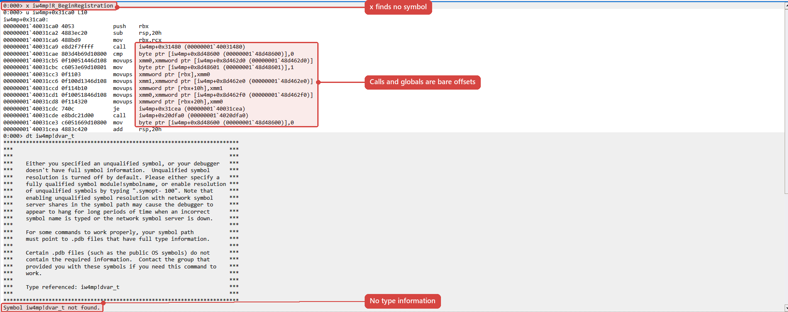
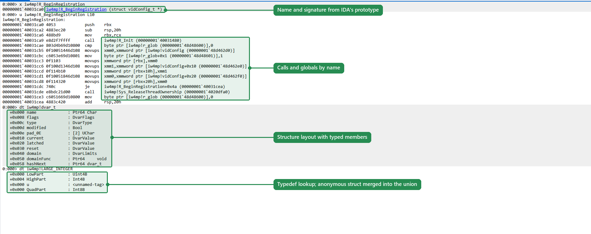
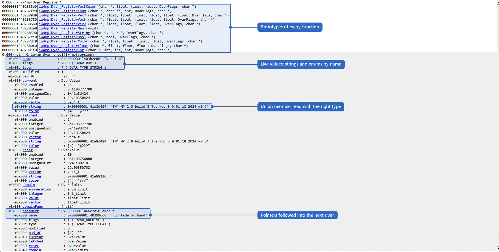
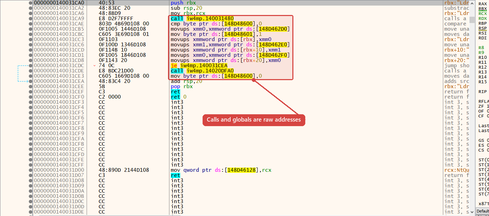
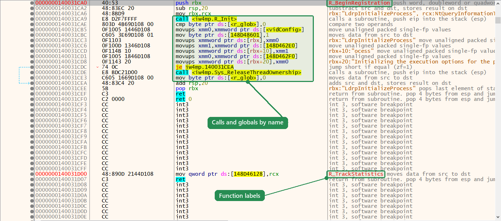
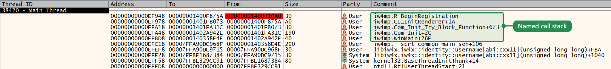

# IDA2PDB

Exports the names and types of an IDA database to a PDB that matches the analyzed executable, so that WinDbg, x64dbg and Visual Studio treat it like a compiler-generated PDB.

The PDB takes its GUID and age from the executable's RSDS record and addresses every symbol by section and offset, so debuggers load it without forcing a mismatch.  
It contains:

| Content | CodeView | Effect in the debugger |
| --- | --- | --- |
| All exported names | `S_PUB32` | address-to-name resolution in disassembly, call stacks, `ln` |
| Typed functions | `S_GPROC32`, `S_LOCAL` parameters | signatures (`x`), procedure lookup by address |
| Typed globals | `S_GDATA32` | `dt module!g_name` with contents |
| Structures, unions, enums, pointers, arrays, function types | TPI type records | `dt module!Type address` |
| Typedefs | `S_UDT` | lookup by typedef name |
| Section headers and contributions | DBI | address mapping, procedure lookup in DIA |

Types are taken from IDA's type model, not compiled from C: member offsets are IDA's, so packed layouts, gaps, anonymous unions, bitfields and types from IDA's type libraries (Windows SDK) come out exactly.  
Supported targets are x86 and x64 PE images.  
No decompiler is required.

## Contents

- [Motivation](#motivation)
- [Screenshots](#screenshots)
- [Requirements](#requirements)
- [Installation](#installation)
- [Usage](#usage)
- [Selecting symbols and types](#selecting-symbols-and-types)
- [Diagnostics and the report](#diagnostics-and-the-report)
- [Image identity](#image-identity)
- [The PDB writer](#the-pdb-writer)
- [Loading the PDB](#loading-the-pdb)
- [Troubleshooting](#troubleshooting)
- [Limitations](#limitations)
- [Further reading](#further-reading)
- [License](#license)

## Motivation

Reverse engineering a closed-source program in IDA produces the information a debugging session lacks: function and global names, prototypes, and the layouts of the program's data structures.  
Without debug information for the binary, that knowledge stays in IDA.  
In the debugger, the same code shows up as `sub_14001A2B0` and raw memory dumps.

A PDB is the native way to carry this information into Windows debuggers.  
Every debugger on the platform consumes it, it is matched to the binary automatically, and it supports type-aware inspection (`dt`, watch windows, expression evaluation) that name-only formats such as x64dbg databases or label maps cannot provide.

The established tool for this, [FakePDB](https://github.com/Mixaill/FakePDB), turned out not to be fully usable with x64dbg and WinDbg in practice.  
Its PDB writer emits publics only:

- the type streams are created but left empty;
- the code for procedures and globals is disabled;
- there are no modules or section contributions;
- the section table is synthesized from IDA's segments rather than taken from the executable.

That is enough to resolve addresses to names.  
It is not enough to inspect a structure, see a function's signature, or let DIA (and therefore x64dbg) resolve an address to a procedure.

This project was written to close that gap.  
Its PDBs have a compiler-generated PDB's structure:

- full CodeView type information derived from IDA's type model;
- typed procedures and globals;
- typedef symbols;
- the executable's own section headers;
- section contributions.

It is tested with both dbghelp (WinDbg) and DIA (x64dbg).  
On a test image, WinDbg's `dt` output for every type is identical to that of the PDB the compiler and linker produced for the same image.

[docs/design.md](docs/design.md) explains the decisions that this required, including an earlier approach that compiled IDA's C declarations with Clang and failed on real databases.

## Screenshots

The screenshots show a 64-bit game executable whose IDA database was exported with this tool.  
"Before" is the same executable without a PDB.

### WinDbg

Same commands, same image, opened offline (`-z`):

| Before | After |
| --- | --- |
|  |  |

Attached to the running game, with typed globals read from live memory:



### x64dbg

The same function in the CPU view:

| Before | After |
| --- | --- |
|  |  |

The call stack at a breakpoint in the running game:



## Requirements

- Python 3.10+.
- IDA Pro 9.2 with IDAPython for collection.  
  The command line collects through idalib.
- To build the native writer: LLVM with development files (`llvm-config`, PDB libraries), Clang and lld.  
  Not needed with a release archive, which ships a prebuilt static writer.
- A PE image with an RSDS debug record (any image linked with `/DEBUG` or equivalent).

## Installation

**Release archive.**  
Download `ida2pdb.zip` from the releases and extract its `ida2pdb` folder into IDA's user plugin directory (`%APPDATA%\Hex-Rays\IDA Pro\plugins`, `~/.idapro/plugins`, or `$IDAUSR/plugins`).  
It contains the plugin, the `ida2pdb` package and a static writer.

**From source.**

```sh
python -m pip install .                                 # the ida2pdb command
python tools/package_plugin.py dist/ida2pdb.zip  # the plugin archive
```

`.config/configuration.winget` provisions a Windows build environment (Python, MSYS2 with LLVM/Clang/lld, Windows SDK) via double-click or `winget configure -f .config/configuration.winget`.  
A dev container for Codespaces / VS Code is in `.devcontainer/`.  
See [docs/development.md](docs/development.md).

## Usage

### IDA plugin

**Edit -> Plugins -> Export PDB**, then:

1. **PDB** builds the PDB; **Snapshot** saves a JSON snapshot for a later `ida2pdb build`.
2. Choose whether to include assigned types (**No** exports names only).
3. Select the executable (defaults to IDA's input file) and the output (defaults to the PDB name recorded in the executable, next to it).

Collection runs on the main thread; the build runs in a worker thread and can be cancelled by running the plugin again.  
The summary and diagnostics go to the output window, the full report to `<output>.report.json`.  
The plugin uses the default selection; the CLI and API expose the rest.

### Command line

```sh
ida2pdb export app.i64 --exe app.exe                  # collect + build
ida2pdb collect app.i64 -o app.symbols.json           # collect only (idalib)
ida2pdb build app.symbols.json --exe app.exe          # build only (no IDA)
ida2pdb build-writer --static -o ida2pdb-pdbgen.exe    # build the native writer
```

`collect` and `export` run under idalib, so use the interpreter idalib is configured for (`idalib/python/py-activate-idalib.py`).  
The database must be closed and packed; one with unpacked `.id0`/`.id1`/... files beside it is refused.  
Collection works on a temporary copy with user plugins disabled and never writes to the input.

The snapshot format is documented in [docs/snapshot-format.md](docs/snapshot-format.md); it can be versioned, diffed, or produced by other tools.

Options of `build` and `export`:

| Option | Effect |
| --- | --- |
| `-o FILE` | output PDB; default: the RSDS file name, next to the executable |
| `--report FILE` | write the full report as JSON |
| `--json` | print the report instead of the summary |
| `--publics-only` | names only; no types, procedures or typed globals |
| `--strict` | fail on any diagnostic; an existing output is left untouched |
| `--allow-image-mismatch` | accept an executable whose hash differs from IDA's input ([Image identity](#image-identity)) |
| `--snapshot FILE` | (`export`) also save the snapshot |
| `--pdbgen`, `--llvm-config`, `--cxx`, `--cache-dir` | writer selection ([The PDB writer](#the-pdb-writer)) |

Exit status: 0 on success, 1 on error, 130 on interrupt.

### Python API

```python
# In IDA, on the main thread:
from ida2pdb.ida_collect import CollectOptions, collect_current
collect_current(CollectOptions(types="all")).save("app.symbols.json")

# Anywhere:
from ida2pdb.builder import BuildOptions, build_pdb, summarize
from ida2pdb.model import Snapshot
report = build_pdb(Snapshot.load("app.symbols.json"), "app.exe", "app.pdb",
                   options=BuildOptions(strict=True))
print(summarize(report))
```

`collect_database(path, options)` collects a closed database through idalib.  
Failures raise `ida2pdb.errors.ExportError`.

## Selecting symbols and types

| Option | Default | Meaning |
| --- | --- | --- |
| `--names user\|all` | `user` | user-assigned names only, or IDA's full name list (library and imported names included) |
| `--types none\|referenced\|all` | `referenced` | no types; the transitive closure of the types the symbols use; or additionally all local types |
| `--inferred-types` | off | also use types IDA inferred, not only explicitly assigned ones (`is_userti`) |
| `--include REGEX` / `--exclude REGEX` | | filter by name |
| `--segment NAME` | | restrict to IDA segments; repeatable |

Mapping:

| IDA | PDB |
| --- | --- |
| function start with a function type | procedure with extent, signature and named parameters |
| function start without a type | public flagged as function |
| data item with a type | typed global |
| anything else | public |

Names are exported verbatim (decorated or not).  
Addresses are stored as RVAs, so rebasing the database does not change the result.

## Diagnostics and the report

Anything that cannot be represented is reported, never dropped silently; the symbol usually keeps its public.

| Code | Meaning |
| --- | --- |
| `outside_sections` | address in no PE section (e.g. `__ImageBase` in the header); not representable in a PDB |
| `outside_image` | address is not a valid RVA |
| `invalid_extent` | function or global type extends past its section; only the public is kept |
| `invalid_function_type` | a function's type is not a function type; only the public is kept |
| `invalid_parameters` | parameter name count differs from the type's parameter count; names are dropped |
| `type_unavailable` | IDA cannot resolve a referenced type, or an enum has an unsupported width |
| `type_missing` | the snapshot references a type it does not define; emitted as a forward declaration |
| `typedef_cycle` | a typedef refers to itself |
| `member_skipped` | member not representable: non-bitfield at a bit offset, bitfield wider than its unit, self-containing anonymous member, oversized array |
| `member_count` | more than 65535 members; the record count is capped, the field list is complete |

`--strict` makes any diagnostic fatal.  
In all modes the output is replaced atomically after the writer succeeds, so a failed or cancelled build never leaves a partial PDB.

The report (`--report`, `--json`, or the plugin's `.report.json`) contains the output path, the executable's identity (arch, SHA-256, GUID, age, RSDS PDB name, verification result), counts, and all diagnostics.

## Image identity

GUID, age and sections always come from the executable passed with `--exe`.  
The snapshot records the SHA-256 of IDA's input file, and the build refuses an executable with a different hash.  
Patched copies and other copies of the same build differ in hash but not in layout; `--allow-image-mismatch` accepts them and marks the report accordingly.  
Only use it when the section layout is identical.  
Snapshots without a hash are reported as unverified.

The tool never modifies executables.  
Images without an RSDS record cannot be matched by any PDB and are rejected.

## The PDB writer

`ida2pdb-pdbgen` (`ida2pdb/native/pdbgen.cxx`) serializes the records with LLVM's PDB libraries.  
Lookup order:

1. `--pdbgen` / `IDA2PDB_PDBGEN`;
2. `ida2pdb-pdbgen` on `PATH`;
3. `ida2pdb/bin/` inside the package (release archives);
4. a source build against `llvm-config` (`--llvm-config` / `LLVM_CONFIG`) with the `clang++` beside it (`--cxx` / `IDA2PDB_CXX`), cached by source and toolchain hash (`--cache-dir`; default `%LOCALAPPDATA%\ida2pdb` or `~/.cache/ida2pdb`).

Cached builds link libLLVM dynamically; the tool puts LLVM's `bin` directory on the writer's `PATH`.  
`ida2pdb build-writer --static` produces a self-contained executable.

## Loading the PDB

Debuggers search for the file name stored in the RSDS record and require matching GUID and age.  
The default output location (next to the executable, RSDS file name) is already on every debugger's search path.

**WinDbg / cdb:**

```text
.sympath+ C:\symbols\app
.reload /f app.exe
x app!Player_*
dt app!Player 0x12345678
```

**x64dbg** (DIA) loads the PDB on module load if it finds it; otherwise use `symload app, C:\symbols\app\app.pdb`.

**Visual Studio** uses the executable's directory and the symbol locations under *Tools -> Options -> Debugging -> Symbols*.

DIA searches the executable's directory before the symbol path: a stale PDB there with matching GUID and age takes precedence.

## Troubleshooting

| Symptom | Cause |
| --- | --- |
| `has no RSDS CodeView record` | image linked without debug information; no PDB can match it |
| `SHA-256 differs` | executable is not IDA's input file; see [Image identity](#image-identity) |
| `... exists: the database is open or was not packed` | close the database in IDA (packing it) or use the plugin |
| `idalib is unavailable` | wrong interpreter; run under the Python configured for idalib |
| `executable not found: llvm-config` | no writer available; install LLVM, set `LLVM_CONFIG`, or pass `--pdbgen` |
| x64dbg symbols shifted by 0x1000 | a stale PDB next to the executable is loaded instead; typically one whose section table was taken from IDA's segments |
| type shown without members | declared-only in IDA, or unresolved (`type_unavailable` in the report) |

## Limitations

- x86 and x64 PE only.
- No line information, locals or parameter locations.  
  Parameters are emitted as location-less `S_LOCAL` records: signatures show, values do not, since IDA's argument locations are only valid at entry.
- A procedure covers the function's entry chunk.  
  Code in other chunks resolves to the nearest preceding public (`S_SEPCODE` was evaluated; neither dbghelp nor DIA uses it for lookup).
- Untyped functions are publics only.
- Typedefs are `S_UDT` symbols; types referencing them resolve to the target (as in MSVC PDBs), so member types show the underlying type.
- `__usercall`/`__userpurge` map to `CV_CALL_GENERIC`; register assignments are not representable in CodeView.  
  Parameter types are kept.
- C++ as modeled by IDA: base classes as `LF_BCLASS`, the vftable as a plain member.  
  Methods and virtual bases are not emitted.
- Each export produces a fresh PDB; merging with an existing PDB is not supported.

## Further reading

- [docs/design.md](docs/design.md): architecture, the IDA-to-CodeView mapping and the rationale behind it, with references to the format specifications.
- [docs/snapshot-format.md](docs/snapshot-format.md): the snapshot schema.
- [docs/development.md](docs/development.md): code layout, tests, verification and releases.

## License

IDA2PDB is free software: you can redistribute it and/or modify it under the terms of the GNU General Public License as published by the Free Software Foundation, either version 3 of the License, or (at your option) any later version.  
See [LICENSE](LICENSE) for the full text.
