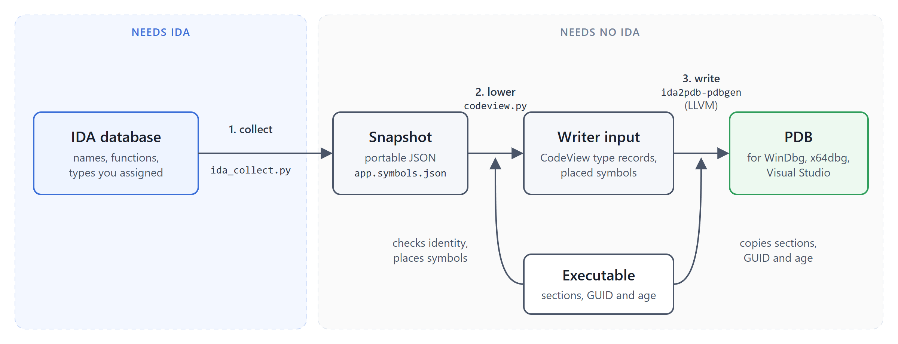

# Design

This document describes the export pipeline, how IDA's type model is mapped to CodeView, and the evidence behind the less obvious decisions.  
Specifications are linked under [References](#references).



| Stage | Code | Needs IDA |
| --- | --- | --- |
| Collect: names and types into a snapshot | `ida2pdb/ida_collect.py` | yes |
| Snapshot: validated, IDA-independent data | `ida2pdb/model.py` ([schema](snapshot-format.md)) | no |
| Lower: CodeView type records, symbol placement | `ida2pdb/codeview.py`, `ida2pdb/builder.py`, `ida2pdb/pe.py` | no |
| Write: PDB streams via LLVM | `ida2pdb/native/pdbgen.cxx` | no |

Everything after collection works on the snapshot alone, so a PDB can be rebuilt without IDA.

## Collection

The collector walks IDA's name list.  
A name at a function start becomes a `function`, a name on a data item `data`, anything else a `label`.  
By default only user names (`has_user_name`) and explicitly assigned types (`is_userti`) are taken: inferred types, such as a stack argument typed `char ArgList`, would otherwise be indistinguishable from reviewed prototypes.

### Types as data

Types are read through `tinfo_t` and recorded structurally: a structure is its size and its members with byte or bit offsets; a reference to a named type is `{"ref": name}`.  
Named types are resolved from a work list, so mutually recursive types and long reference chains need no recursion, and the closure includes types from IDA's base type libraries (`HRESULT`, `FILE`, `IDirect3D9`, ...).

An earlier design printed IDA's declarations (`print_decls`) and compiled them with Clang into CodeView.  
On real databases this produced no types at all:

- nested anonymous types print as out-of-class definitions (`struct Outer::$742A... {...}`), which are ill-formed C++;
- IDA's type libraries declare `typedef unsigned __int16 wchar_t`, and `wchar_t` is a keyword;
- types from base type libraries are not local types and are never printed, so every symbol using them failed to compile.

A single error in the shared declarations discarded every type, and layouts had to be re-verified against IDA with `static_assert`.  
CodeView describes layouts by explicit member offsets, so emitting it directly from IDA's model is exact and removes the compiler from the export path.

Details:

- IDA 9 names nested anonymous UDTs `Outer::$HASH`; these are flagged `anonymous`.  
  Anonymity is decided by name only, so a named type that IDA flags anonymous keeps its name.
- `typedef A B` is recorded as a reference to `A`, preserving qualifiers; `typedef void *HANDLE` as the type it describes.  
  Typedefs of `wchar_t` and the other keyword character types map to the corresponding builtin, so debuggers render them as characters.
- Gaps, methods and zero-width bitfields are omitted.
- Enumerator values are stored by IDA as 64-bit patterns and are sign-extended from the enum's width when IDA marks it signed.

### Closed databases

`collect_database()` opens a private copy of a packed database through idalib with an empty `IDAUSR` and closes it without saving.  
idalib can leave unpacked files behind even on a non-saving close; in the copy they vanish with the temporary directory.  
A database with unpacked files beside it is refused, since its on-disk state is incomplete.

## Lowering to CodeView

`codeview.Lowering` emits a list of type records in which every record refers only to simple types and earlier records.  
The unit tests check this invariant.  
Identical records are deduplicated.

### Simple types and pointers

Builtins map to the simple types MSVC uses for C types of the same width (`T_INT4`, `T_QUAD`, `T_RCHAR`, `T_WCHAR`, ...).  
An unqualified pointer to a simple type is a simple type with a pointer mode (`T_64PVOID`), as compilers emit it; other pointers are `LF_POINTER` records sized by the pointer (`__ptr32` included).  
Qualifiers on pointers go into the pointer record, also through typedefs (`const HANDLE`); other qualified types use `LF_MODIFIER`.

### Structures and forward references

A named structure is referenced through a forward-reference record (`ForwardReference`, name only) and defined by a later complete record, as compilers emit them.  
Consumers resolve the reference by name through the TPI hash table, where the definition is hashed by name.  
This decouples emission order from reference order and handles pointer cycles.

Members are `LF_MEMBER` records at IDA's offsets and the size is IDA's; nothing is recomputed, so packing, alignment, gaps and overlapping members are preserved.  
Base classes are `LF_BCLASS`.

### Anonymous members

Anonymous UDTs are emitted as complete records named `<unnamed-tag>`, as in MSVC PDBs; without a unique name they cannot be resolved through a forward reference.  
An unnamed member of anonymous type is flattened into the enclosing field list at the combined offset, recursively, which is how MSVC describes e.g. `_LARGE_INTEGER` and what makes `value.LowPart` evaluate in a debugger.  
A named member of anonymous type (`_LARGE_INTEGER::u`) references the `<unnamed-tag>` record.

### Bitfields

A bitfield is an `LF_MEMBER` of `LF_BITFIELD` type (unit type, width, bit position) at the unit's byte offset.  
The snapshot gives absolute bit offsets; the unit is placed at the multiple of its size containing the field (MSVC's placement), falling back to the field's first byte in packed layouts.  
Either placement yields the correct value, since consumers read the unit and extract the bits.

### Enumerations and typedefs

Enums are `LF_ENUM` with the underlying simple type and an `LF_ENUMERATE` per value; negative values use signed numeric leaves.

CodeView has no typedef type record.  
References to a typedef resolve to its target, and each typedef becomes an `S_UDT` in the globals stream, which is what `dt module!HANDLE` finds.  
This matches MSVC output.

### Function types

`LF_PROCEDURE` with an `LF_ARGLIST`; variadic functions end the argument list with `T_NOTYPE`.

| IDA | x86 | x64 |
| --- | --- | --- |
| `__cdecl`, unknown | `NEAR_C` | `NEAR_C` |
| `__stdcall` | `NEAR_STD` | `NEAR_C` |
| `__fastcall` | `NEAR_FAST` | `NEAR_C` |
| `__thiscall` | `THISCALL` | `NEAR_C` |
| `__pascal` | `NEAR_PASCAL` | `NEAR_C` |
| `__vectorcall` | `NEAR_VECTOR` | `NEAR_VECTOR` |
| `__usercall`, `__userpurge`, Go | `GENERIC` | `GENERIC` |

x64 has a single convention, which MSVC and Clang emit as `NEAR_C` regardless of the source annotation.  
CodeView types carry no argument locations, so register-argument functions keep their parameter types under `GENERIC`.

### Undefined types

Declared-only types and references the snapshot does not define become forward references without a definition; debuggers show the name without members.  
Missing definitions are reported (`type_missing`) unless the collector already reported them (`type_unavailable`).

## Writing the PDB

`builder.py` places each symbol in a PE section, drops what cannot be placed (with diagnostics), and hands records and symbols to `ida2pdb-pdbgen`:

| Stream | Content |
| --- | --- |
| PDB info | GUID and age from the RSDS record, PE timestamp as signature |
| DBI | machine, age, the executable's section headers (debug stream) and section map, section contributions |
| Module `<exe> (IDA)` | per typed function: `S_GPROC32`, one `S_LOCAL` per parameter, `S_END` |
| Globals | `S_PROCREF` per procedure, `S_GDATA32` per typed global, `S_UDT` per typedef |
| Publics | `S_PUB32` per symbol; functions flagged `Function \| Code` |
| TPI | the lowered records with their hashes |
| IPI | empty (id records describe source, which does not exist) |

The following were determined by testing against dbghelp (cdb) and DIA (x64dbg's `msdia140.dll`):

- **Section headers.**  
  Symbols are stored as section:offset and resolved through the section headers in the PDB, so these must be the executable's, in its order.  
  A PDB whose section table was derived from IDA's segments, where segment 1 is the `HEADER` pseudo-segment at RVA 0, resolves every symbol 0x1000 bytes low in DIA.  
  IDA segments are never used for this; they are only a selection filter.
- **Section contributions.**  
  DIA maps an address to a module through the contributions before searching that module's symbols.  
  Without them, `IDiaSession::findSymbolByRVA(..., SymTagFunction)` finds nothing, even at a procedure's first byte, and lookups fall back to publics.
- **Parameters.** dbghelp builds the signature shown by `x` from a procedure's parameter symbols, not from its type.  
  IDA knows parameter names and types but not their locations beyond the entry point, so each parameter is an `S_LOCAL` flagged `IsParameter | IsOptimizedOut` with no `S_DEFRANGE`.  
  DIA does not enumerate such parameters (with or without the flag).
- **Function chunks.**  
  `S_SEPCODE` scopes for IDA's tail chunks were implemented and tested; neither dbghelp (`ln`) nor DIA (`findSymbolByRVA`) attributes addresses through them, so they were removed.

Names outside every section (e.g. `__ImageBase`) cannot be addressed by a PDB symbol.  
Typed symbols whose extent crosses their section's end keep only the public.  
Both are reported.

### Writer input

The builder passes a JSON document to the writer.  
It is internal, but documented here for debugging:

```json
{
  "module": "app (IDA)",
  "types": [
    {"leaf": "struct", "name": "Node", "forward": true},
    {"leaf": "pointer", "referent": 4096, "size": 8,
     "const": false, "volatile": false},
    {"leaf": "fieldlist",
     "fields": [{"kind": "member", "name": "next", "type": 4097, "offset": 0}]},
    {"leaf": "struct", "name": "Node", "forward": false,
     "fields": 4098, "count": 1, "size": 8},
    {"leaf": "arglist", "args": [4097]},
    {"leaf": "procedure", "return": 3, "cc": 0, "args": 4100, "count": 1}
  ],
  "procedures": [{"name": "f", "rva": 4096, "size": 16, "type": 4101,
                  "params": [{"name": "node", "type": 4097}]}],
  "globals": [{"name": "head", "rva": 8192, "type": 4096}],
  "typedefs": [{"name": "NodeAlias", "type": 4096}],
  "publics": [{"name": "f", "rva": 4096, "function": true}]
}
```

Type references below `0x1000` are simple type indices; others are `0x1000` plus the position of a preceding record in `types`.  
Positions are not final type indices: field lists exceeding the record size limit are split into `LF_INDEX`-chained records by LLVM, so the writer maps positions as it appends.

| `leaf` | Fields |
| --- | --- |
| `modifier` | `type`, `const`, `volatile` |
| `pointer` | `referent`, `size` (4 or 8), `const`, `volatile` |
| `array` | `element`, `index` (index type), `size` (bytes) |
| `arglist` | `args` |
| `procedure` | `return`, `cc` (`CV_call_e`), `args`, `count` |
| `bitfield` | `type`, `width`, `position` |
| `fieldlist` | `fields`: `member` (`name`, `type`, `offset`), `base` (`type`, `offset`), `enumerator` (`name`, `value`) |
| `struct`, `union` | `name`, `forward`; unless forward: `fields`, `count`, `size` |
| `enum` | `name`, `underlying`, `fields`, `count` |

All fields are required and range-checked, and references must point backwards.  
Invalid input terminates the writer with a message and no output.  
On success it prints `{"type_records": N}`.

## Robustness

- The PDB is staged in a temporary directory beside the output and moved into place (`os.replace`) only after the writer succeeded; an existing PDB is either replaced completely or left untouched.
- External processes run under a cancellation event and a timeout, and are killed when either fires.
- The plugin collects on IDA's main thread (required by the IDA API) and builds in a worker thread that never calls IDA; a timer polls for the result.
- Snapshots are pure data and fully validated before use; nothing in them is evaluated or executed.

## References

### PDB and CodeView

- [LLVM: The PDB File Format][llvm-pdb], in particular the [MSF container][llvm-msf], [PDB info stream][llvm-info], [TPI stream and hashing][llvm-tpi], [DBI stream][llvm-dbi], [module streams][llvm-modi], [publics][llvm-publics] and [globals][llvm-globals] streams, [CodeView type records][llvm-cvtypes] and [CodeView symbol records][llvm-cvsymbols].
- [microsoft/microsoft-pdb][ms-pdb], notably [cvinfo.h][cvinfo]: the reference definitions of CodeView records, simple types and calling conventions.
- [llvm-pdbutil][llvm-pdbutil].

### PE and toolchain

- [PE format][pe]: section table, debug directory.
- [MSVC /DEBUG][msvc-debug], [/PDBALTPATH][msvc-pdbaltpath], [symbol files][symbol-files].
- [Argument passing and naming conventions][calling], [x64 calling convention][calling-x64], [C++ bit fields][bitfields].

### Debuggers

- [DIA SDK][dia]: [IDiaDataSource::loadDataForExe][dia-load], [IDiaSession::findSymbolByRVA][dia-find].
- WinDbg: [symbol path][windbg-sympath], [dt][windbg-dt], [x][windbg-x], [cdb options][cdb].
- x64dbg: [symload][x64dbg-symload].

### IDA

- [IDAPython][idapython], especially [ida_typeinf][ida-typeinf].
- [idalib][idalib].
- [Custom calling conventions][ida-usercall] (`__usercall`).
- [Plugin packaging][ida-plugin] (`ida-plugin.json`).  
  IDA 9.2 loads the plugin without `plugin.version`; the plugin repository requires it.

### Prior work

- [FakePDB][fakepdb]: an earlier IDA-to-PDB exporter whose output was not fully usable in x64dbg and WinDbg.

[llvm-pdb]: https://llvm.org/docs/PDB/index.html
[llvm-msf]: https://llvm.org/docs/PDB/MsfFile.html
[llvm-info]: https://llvm.org/docs/PDB/PdbStream.html
[llvm-tpi]: https://llvm.org/docs/PDB/TpiStream.html
[llvm-dbi]: https://llvm.org/docs/PDB/DbiStream.html
[llvm-modi]: https://llvm.org/docs/PDB/ModiStream.html
[llvm-publics]: https://llvm.org/docs/PDB/PublicStream.html
[llvm-globals]: https://llvm.org/docs/PDB/GlobalStream.html
[llvm-cvtypes]: https://llvm.org/docs/PDB/CodeViewTypes.html
[llvm-cvsymbols]: https://llvm.org/docs/PDB/CodeViewSymbols.html
[llvm-pdbutil]: https://llvm.org/docs/CommandGuide/llvm-pdbutil.html
[ms-pdb]: https://github.com/microsoft/microsoft-pdb
[cvinfo]: https://github.com/microsoft/microsoft-pdb/blob/master/include/cvinfo.h
[pe]: https://learn.microsoft.com/en-us/windows/win32/debug/pe-format
[msvc-debug]: https://learn.microsoft.com/en-us/cpp/build/reference/debug-generate-debug-info
[msvc-pdbaltpath]: https://learn.microsoft.com/en-us/cpp/build/reference/pdbaltpath-use-alternate-pdb-path
[symbol-files]: https://learn.microsoft.com/en-us/windows/win32/debug/symbol-files
[calling]: https://learn.microsoft.com/en-us/cpp/cpp/argument-passing-and-naming-conventions
[calling-x64]: https://learn.microsoft.com/en-us/cpp/build/x64-calling-convention
[bitfields]: https://learn.microsoft.com/en-us/cpp/cpp/cpp-bit-fields
[dia]: https://learn.microsoft.com/en-us/visualstudio/debugger/debug-interface-access/debug-interface-access-sdk
[dia-load]: https://learn.microsoft.com/en-us/visualstudio/debugger/debug-interface-access/idiadatasource-loaddataforexe
[dia-find]: https://learn.microsoft.com/en-us/visualstudio/debugger/debug-interface-access/idiasession-findsymbolbyrva
[windbg-sympath]: https://learn.microsoft.com/en-us/windows-hardware/drivers/debugger/symbol-path
[windbg-dt]: https://learn.microsoft.com/en-us/windows-hardware/drivers/debuggercmds/dt--display-type-
[windbg-x]: https://learn.microsoft.com/en-us/windows-hardware/drivers/debuggercmds/x--examine-symbols-
[cdb]: https://learn.microsoft.com/en-us/windows-hardware/drivers/debugger/cdb-command-line-options
[x64dbg-symload]: https://help.x64dbg.com/en/latest/commands/analysis/symload.html
[idapython]: https://python.docs.hex-rays.com/
[ida-typeinf]: https://python.docs.hex-rays.com/ida_typeinf/index.html
[idalib]: https://docs.hex-rays.com/user-guide/idalib
[ida-usercall]: https://hex-rays.com/blog/igors-tip-of-the-week-51-custom-calling-conventions
[ida-plugin]: https://docs.hex-rays.com/developer/publishing-plugins/concepts/plugin-packaging-and-format
[fakepdb]: https://github.com/Mixaill/FakePDB
